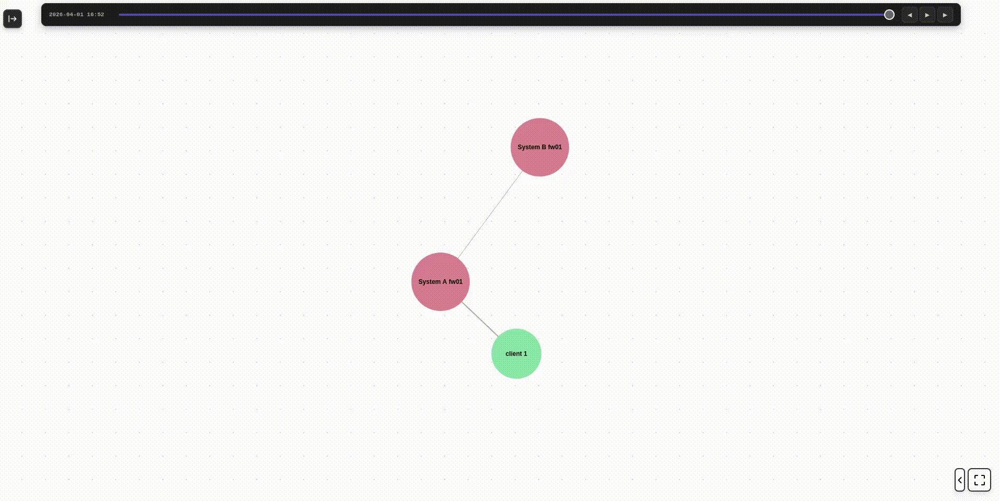
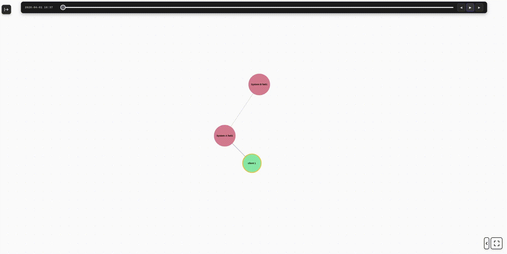

# Netline

Self-hosted network graph documentation tool. Runs in docker.


Main showcase



Timeline showcase


---

## Starting the app

```bash
chmod +x start.sh
./start.sh
```

Open [http://localhost:3000](http://localhost:3000)

The script handles everything: building images, waiting for the database, and running migrations. On first run it will ask whether to reset the database.

---

## Offline deployment

Two export modes are available. Both produce a single `netline.tar.gz` containing the full project and Docker images.

**Clean slate** — no data, fresh database on first run:

```bash
./start.sh --export
```

**With database** — includes a snapshot of the current database:

```bash
./start.sh --export-with-db
```

Copy `netline.tar.gz` to the target machine, then:

```bash
tar -xzf netline.tar.gz
cd netline && ./start.sh
```
 
The script detects the bundled images and loads them automatically.

---

## Importing a graph

If you have an existing `graph.json` from a previous version:

```bash
docker compose cp ./graph.json app:/app/graph.json
docker compose exec app node scripts/import.js /app/graph.json
```

The import is non-destructive — existing nodes, links, notes, and events are preserved.

---

## Database access

```bash
# Prisma Studio — visual browser (access via SSH tunnel, port not exposed publicly)
docker compose exec app npx prisma studio

# MySQL shell
docker compose exec db mysql -u netline --password=netlinepassword netline
```

---

## Logs

```bash
docker compose logs -f app
docker compose logs -f db
```

---

## API endpoints

| Method | Path            | Description                                        |
|--------|-----------------|----------------------------------------------------|
| GET    | `/graph`        | Full graph as `{nodes, links}`                     |
| POST   | `/add-node`     | Add a node                                         |
| POST   | `/edit-node`    | Edit a node (migrates ID if hostname/system changed) |
| POST   | `/delete-node`  | Delete a node (cascades IPs, links, note, events)  |
| POST   | `/save-graph`   | Replace entire graph (from JSON editor)            |
| POST   | `/import`       | Non-destructive graph import                       |
| GET    | `/notes`        | All notes as `{nodeId: content}`                   |
| POST   | `/save-note`    | Save or clear a note for a node                    |
| GET    | `/events`       | All events sorted by datetime                      |
| POST   | `/add-event`    | Add an event to a node                             |
| POST   | `/edit-event`   | Update an existing event                           |
| POST   | `/delete-event` | Delete an event                                    |

---

## Environment variables

Defaults work out of the box. Override by editing `.env`:

```env
MYSQL_ROOT_PASSWORD=rootpassword
MYSQL_PASSWORD=netlinepassword
PORT=3000
```
